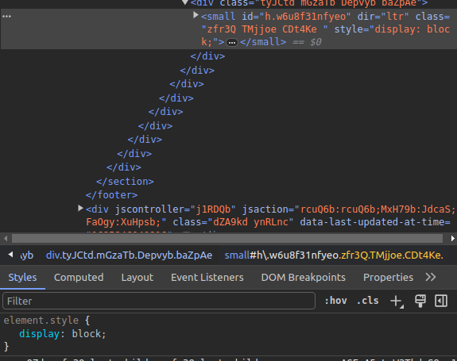
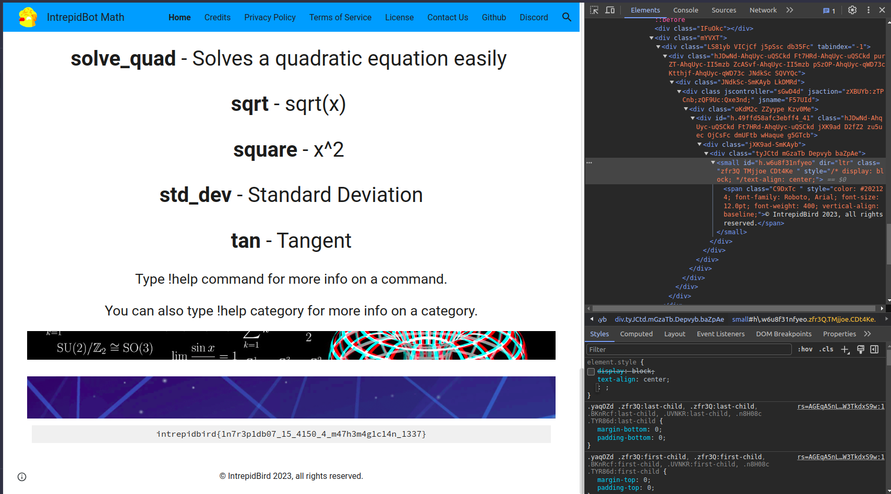

# Issue-5

Arrange the text of the footer such that it can be in the center of the screen

## Cause
- The css assigned to the parent tag of the ```<span>``` tag causes the text not to be in the center of the screen.




<br>
<br>
<br>

# Solution
Change the css to ```text-align: center;``` to get the text in the center


